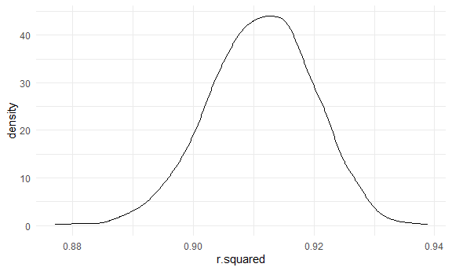
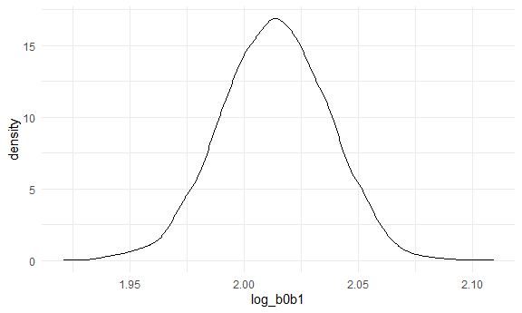
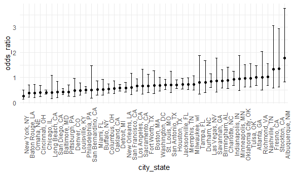
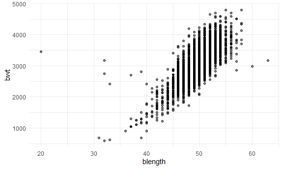
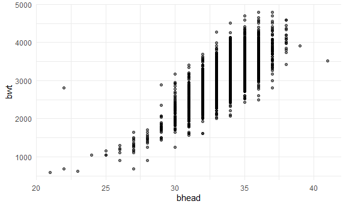
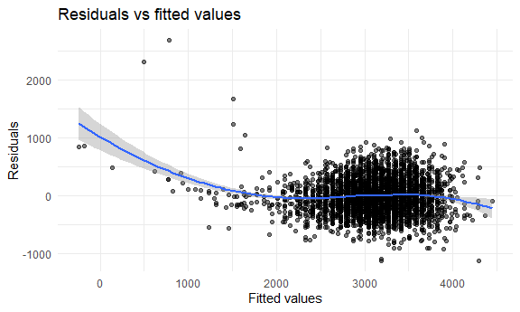
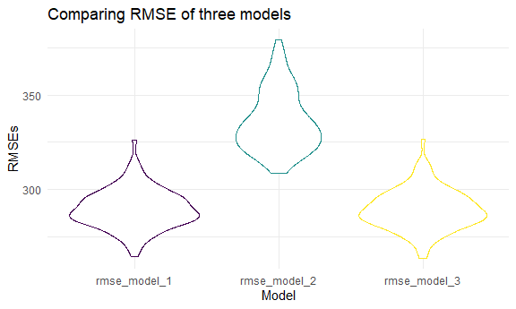

Homework 6
================
Tim Hauser

## Initial setup

``` r
library(tidyverse)
```

    ## ── Attaching packages ─────────────────────────────────────── tidyverse 1.3.2 ──
    ## ✔ ggplot2 3.3.6      ✔ purrr   0.3.4 
    ## ✔ tibble  3.1.8      ✔ dplyr   1.0.10
    ## ✔ tidyr   1.2.0      ✔ stringr 1.4.1 
    ## ✔ readr   2.1.2      ✔ forcats 0.5.2 
    ## ── Conflicts ────────────────────────────────────────── tidyverse_conflicts() ──
    ## ✖ dplyr::filter() masks stats::filter()
    ## ✖ dplyr::lag()    masks stats::lag()

``` r
library(viridis)
```

    ## Loading required package: viridisLite

``` r
library(modelr)


#library(p8105.datasets)
#library(moderndive)

set.seed(1)

knitr::opts_chunk$set(
  fig.width = 6,
  fig.asp = .6,
  out.width = "90%"
)

theme_set(theme_minimal() + theme(legend.position = "bottom"))

options(
  ggplot2.continuous.colour = "viridis",
  ggplot2.continuous.fill = "viridis"
)

scale_colour_discrete = scale_colour_viridis_d
scale_fill_discrete = scale_fill_viridis_d
```

## Problem 1

Loading the data:

``` r
weather_df = 
  rnoaa::meteo_pull_monitors(
    c("USW00094728"),
    var = c("PRCP", "TMIN", "TMAX"), 
    date_min = "2017-01-01",
    date_max = "2017-12-31") %>%
  mutate(
    name = recode(id, USW00094728 = "CentralPark_NY"),
    tmin = tmin / 10,
    tmax = tmax / 10) %>%
  select(name, id, everything())
```

    ## Registered S3 method overwritten by 'hoardr':
    ##   method           from
    ##   print.cache_info httr

    ## using cached file: C:\Users\TIMHAU~1\AppData\Local/Cache/R/noaa_ghcnd/USW00094728.dly

    ## date created (size, mb): 2022-09-29 10:32:40 (8.418)

    ## file min/max dates: 1869-01-01 / 2022-09-30

In the following problem, we’ll focus on a simple linear regression with
tmax as the response and tmin as the predictor, and are interested in
the distribution of two quantities estimated from these data: r^2 and
log(β<sup>0∗β</sup>1. We use 5000 bootstrap samples and, for each
bootstrap sample, produce estimates of these two quantities.

First, for r^2: To obtain a distribution for r^2, we’ll follow basically
the same procedure we used for regression coefficients: draw bootstrap
samples; the a model to each; extract the value I’m concerned with; and
summarize. Here, we’ll use `modelr::bootstrap` to draw the samples and
`broom::glance` to produce `r.squared` values.

``` r
weather_df %>% 
  modelr::bootstrap(n = 5000) %>% 
  mutate(
    models = map(strap, ~lm(tmax ~ tmin, data = .x) ),
    results = map(models, broom::glance)) %>% 
  select(-strap, -models) %>% 
  unnest(results) %>% 
  summarize(
    mean_r_sq = mean(r.squared),
    sd_r_sq = sd(r.squared),
    ci_lower = quantile(r.squared, 0.025), 
    ci_upper = quantile(r.squared, 0.975)
    )
```

    ## # A tibble: 1 × 4
    ##   mean_r_sq sd_r_sq ci_lower ci_upper
    ##       <dbl>   <dbl>    <dbl>    <dbl>
    ## 1     0.911 0.00858    0.894    0.927

Then, plotting the distrbution of r^2:

``` r
weather_df %>% 
  modelr::bootstrap(n = 5000) %>% 
  mutate(
    models = map(strap, ~lm(tmax ~ tmin, data = .x) ),
    results = map(models, broom::glance)) %>% 
  select(-strap, -models) %>% 
  unnest(results) %>% 
  ggplot(aes(x = r.squared)) + geom_density()
```



In this example, the r^2 value is high, and the upper bound at 1 may be
a cause for the generally skewed shape of the distribution. If we wanted
to construct a confidence interval for r^2, we could take the 2.5% and
97.5% quantiles of the estimates across bootstrap samples. However,
because the shape isn’t symmetric, using the mean +/- 1.96 times the
standard error probably wouldn’t work well.

Next, we move on to computing log(β<sup>0∗β</sup>1: We can produce a
distribution for log(β<sup>0∗β</sup>1 using a similar approach, with a
bit more wrangling before we make our plot.

``` r
weather_df %>% 
  modelr::bootstrap(n = 5000) %>% 
  mutate(
    models = map(strap, ~lm(tmax ~ tmin, data = .x) ),
    results = map(models, broom::tidy)) %>% 
  select(-strap, -models) %>% 
  unnest(results) %>% 
  select(id = `.id`, term, estimate) %>% 
  pivot_wider(
    names_from = term, 
    values_from = estimate) %>% 
  rename(beta0 = `(Intercept)`, beta1 = tmin) %>% 
  mutate(log_b0b1 = log(beta0 * beta1)) %>% 
  summarize(
    mean_log_b0b1 = mean(log_b0b1),
    sd_log_b0b1 = sd(log_b0b1),
    ci_lower = quantile(log_b0b1, 0.025), 
    ci_upper = quantile(log_b0b1, 0.975)
  )
```

    ## # A tibble: 1 × 4
    ##   mean_log_b0b1 sd_log_b0b1 ci_lower ci_upper
    ##           <dbl>       <dbl>    <dbl>    <dbl>
    ## 1          2.01      0.0239     1.97     2.06

Now we plot the distribution of log(β<sup>0∗β</sup>1:

``` r
weather_df %>% 
  modelr::bootstrap(n = 5000) %>% 
  mutate(
    models = map(strap, ~lm(tmax ~ tmin, data = .x) ),
    results = map(models, broom::tidy)) %>% 
  select(-strap, -models) %>% 
  unnest(results) %>% 
  select(id = `.id`, term, estimate) %>% 
  pivot_wider(
    names_from = term, 
    values_from = estimate) %>% 
  rename(beta0 = `(Intercept)`, beta1 = tmin) %>% 
  mutate(log_b0b1 = log(beta0 * beta1)) %>% 
  ggplot(aes(x = log_b0b1)) + geom_density()
```



As with r^2, this distribution is somewhat skewed and has some outliers.

## Problem 2

Importing the data and doing some high-level cleaning:

``` r
homicide_raw = read.csv("./data/homicide-data.csv") %>% 
  janitor::clean_names()
```

In the following chunk I’m cleaning the dataset as instructed,
including: 1. Creating a city_state variable (e.g. “Baltimore, MD”) 2.
Creating a binary variable indicating whether the homicide is solved 3.
Omiting cities Dallas, TX; Phoenix, AZ; and Kansas City, MO – these
don’t report victim race. Also omit Tulsa, AL – this is a data entry
mistake. 4. Limiting analysis those for whom victim_race is white or
black 5. Making victim_age numeric

``` r
homicide_df =
  homicide_raw %>% 
  mutate(city_state = paste(city, state, sep=", ")) %>% 
  filter(!city_state %in% c("Dallas, TX", "Phoenix, AZ", "Kansas City, MO", "Tulsa, AL")) %>% 
  filter(victim_race %in% c("Black", "White")) %>% 
  mutate(
    status_solved = as.numeric(disposition == "Closed by arrest"),
    victim_age = as.numeric(victim_age)
  ) %>% 
  select(city_state, status_solved, victim_age, victim_sex, victim_race)
```

    ## Warning in mask$eval_all_mutate(quo): NAs introduced by coercion

homicide_df = homicide_raw %\>% mutate(city_state = str_c(city, “,”,
state), status_solved = as.numeric(disposition == “Closed by arrest”) )
%\>% filter(city_state != c(“Dallas, TX”, “Phoenix, AZ”, “Kansas City,
MO”, “Tulsa, AL”), victim_race %in% c(“Black”, “White”)) %\>%
mutate(victim_age = as.numeric(victim_age)) %\>% drop_na(victim_age)
%\>% relocate(city_state)

For the city of Baltimore, MD, I use the glm function to fit a logistic
regression with resolved vs unresolved as the outcome and victim age,
sex and race as predictors; including the following steps: 1. Saving the
output of glm as an R object 2. Applying the broom::tidy to this object
3. Obtain the estimate and confidence interval of the adjusted odds
ratio for solving homicides comparing male victims to female victims
keeping all other variables fixed.

``` r
fit_logistic =
  homicide_df %>% 
  filter(city_state == "Baltimore, MD") %>% 
  glm(status_solved ~ victim_age + victim_sex + victim_race, data = ., family = binomial()) %>%
  broom::tidy() %>% 
  filter(term == "victim_sexMale") %>% 
  select(term, estimate, std.error) %>% 
  mutate(
    odds_ratio = exp(estimate),
    low_conf = exp(estimate - 1.96*std.error),
    upper_conf = exp(estimate + 1.96*std.error)) %>% 
  select(-estimate, -std.error)
```

``` r
fit_logistic %>%
  knitr::kable(digits = 3)
```

| term           | odds_ratio | low_conf | upper_conf |
|:---------------|-----------:|---------:|-----------:|
| victim_sexMale |      0.426 |    0.325 |      0.558 |

Interpretation: those victims who were male, had an estimated 0.426x the
odds of having their homicide resolved compared to female victims.

Next, I ran glm for each of the cities in the dataset, and extracted the
adjusted odds ratio (and CI) for solving homicides comparing male
victims to female victims by: 1. Using a “tidy” pipeline, making use of
purrr::map, 2. Listing columns, 3. Unnesting to create a dataframe with
estimated ORs and CIs for each city

``` r
fit_logistic_2 = 
  homicide_df %>%
  nest(data = -city_state) %>% 
  mutate(model = map(data, ~glm(status_solved ~ victim_age + victim_sex + victim_race, data = ., family = binomial())),
         results = map(model, broom::tidy)) %>% 
  select(-data, -model) %>% 
  unnest(results) %>% 
  filter(term == "victim_sexMale") %>% 
  select(city_state, term, estimate, std.error) %>% 
  mutate(
    odds_ratio = exp(estimate),
    low_conf = exp(estimate - 1.96*std.error),
    upper_conf = exp(estimate + 1.96*std.error)) %>% 
  select(-estimate, -std.error)
```

``` r
fit_logistic_2 %>% 
  knitr::kable(digits = 3)
```

| city_state         | term           | odds_ratio | low_conf | upper_conf |
|:-------------------|:---------------|-----------:|---------:|-----------:|
| Albuquerque, NM    | victim_sexMale |      1.767 |    0.831 |      3.761 |
| Atlanta, GA        | victim_sexMale |      1.000 |    0.684 |      1.463 |
| Baltimore, MD      | victim_sexMale |      0.426 |    0.325 |      0.558 |
| Baton Rouge, LA    | victim_sexMale |      0.381 |    0.209 |      0.695 |
| Birmingham, AL     | victim_sexMale |      0.870 |    0.574 |      1.318 |
| Boston, MA         | victim_sexMale |      0.674 |    0.356 |      1.276 |
| Buffalo, NY        | victim_sexMale |      0.521 |    0.290 |      0.935 |
| Charlotte, NC      | victim_sexMale |      0.884 |    0.557 |      1.403 |
| Chicago, IL        | victim_sexMale |      0.410 |    0.336 |      0.501 |
| Cincinnati, OH     | victim_sexMale |      0.400 |    0.236 |      0.677 |
| Columbus, OH       | victim_sexMale |      0.532 |    0.378 |      0.750 |
| Denver, CO         | victim_sexMale |      0.479 |    0.236 |      0.971 |
| Detroit, MI        | victim_sexMale |      0.582 |    0.462 |      0.734 |
| Durham, NC         | victim_sexMale |      0.812 |    0.392 |      1.683 |
| Fort Worth, TX     | victim_sexMale |      0.669 |    0.397 |      1.127 |
| Fresno, CA         | victim_sexMale |      1.335 |    0.580 |      3.071 |
| Houston, TX        | victim_sexMale |      0.711 |    0.558 |      0.907 |
| Indianapolis, IN   | victim_sexMale |      0.919 |    0.679 |      1.242 |
| Jacksonville, FL   | victim_sexMale |      0.720 |    0.537 |      0.966 |
| Las Vegas, NV      | victim_sexMale |      0.837 |    0.608 |      1.154 |
| Long Beach, CA     | victim_sexMale |      0.410 |    0.156 |      1.082 |
| Los Angeles, CA    | victim_sexMale |      0.662 |    0.458 |      0.956 |
| Louisville, KY     | victim_sexMale |      0.491 |    0.305 |      0.790 |
| Memphis, TN        | victim_sexMale |      0.723 |    0.529 |      0.988 |
| Miami, FL          | victim_sexMale |      0.515 |    0.304 |      0.872 |
| Milwaukee, wI      | victim_sexMale |      0.727 |    0.499 |      1.060 |
| Minneapolis, MN    | victim_sexMale |      0.947 |    0.478 |      1.875 |
| Nashville, TN      | victim_sexMale |      1.034 |    0.685 |      1.562 |
| New Orleans, LA    | victim_sexMale |      0.585 |    0.422 |      0.811 |
| New York, NY       | victim_sexMale |      0.262 |    0.138 |      0.499 |
| Oakland, CA        | victim_sexMale |      0.563 |    0.365 |      0.868 |
| Oklahoma City, OK  | victim_sexMale |      0.974 |    0.624 |      1.520 |
| Omaha, NE          | victim_sexMale |      0.382 |    0.203 |      0.721 |
| Philadelphia, PA   | victim_sexMale |      0.496 |    0.378 |      0.652 |
| Pittsburgh, PA     | victim_sexMale |      0.431 |    0.265 |      0.700 |
| Richmond, VA       | victim_sexMale |      1.006 |    0.498 |      2.033 |
| San Antonio, TX    | victim_sexMale |      0.705 |    0.398 |      1.249 |
| Sacramento, CA     | victim_sexMale |      0.669 |    0.335 |      1.337 |
| Savannah, GA       | victim_sexMale |      0.867 |    0.422 |      1.780 |
| San Bernardino, CA | victim_sexMale |      0.500 |    0.171 |      1.462 |
| San Diego, CA      | victim_sexMale |      0.413 |    0.200 |      0.855 |
| San Francisco, CA  | victim_sexMale |      0.608 |    0.317 |      1.165 |
| St. Louis, MO      | victim_sexMale |      0.703 |    0.530 |      0.932 |
| Stockton, CA       | victim_sexMale |      1.352 |    0.621 |      2.942 |
| Tampa, FL          | victim_sexMale |      0.808 |    0.348 |      1.876 |
| Tulsa, OK          | victim_sexMale |      0.976 |    0.614 |      1.552 |
| Washington, DC     | victim_sexMale |      0.690 |    0.468 |      1.017 |

Lastly, I created a plot that shows the estimated ORs and CIs for each
city and organizes cities according to estimated OR:

``` r
fit_logistic_2 %>% 
  mutate(city_state = fct_reorder(city_state, odds_ratio)) %>% 
  ggplot(aes(x=city_state, y = odds_ratio)) +
  geom_point() +
  geom_errorbar(aes(ymin = low_conf, ymax = upper_conf), width = 0.4) +
  theme(legend.position = "none", axis.text.x = element_text(angle = 90))
```



For most cities included in this statistics, female victims have higher
odds of getting their homicide cases resolved. For most cases, we can
say this with certainty as the their respective confidence intervals do
no cross 1. Only three cases exist where males have the higher odds:
Fresno, Stockton, and Albuquerque. Potentially, this is caused by a low
number of female victims in the statistics that by chance remained
unresolved. in all three cases the CI crosses the 1 odds_ratio line,
meaning they are not statistically significant.

## Problem 2

First, I load and clean the data for regression analysis,
i.e. converting several variables from numeric to factor:

``` r
birthweight_df = read_csv("./data/birthweight.csv") %>% 
  janitor::clean_names() %>%
  mutate(
    babysex = factor(if_else(babysex == 1, "male", "female")),
    frace = factor(recode(frace, '1' = "White", '2' = "Black", '3' = "Asian", '4' = "Puerto Rican", '8' = "Other", '9' = "Unknown")),
    mrace = factor(recode(mrace,'1' = "White", '2' = "Black", '3' = "Asian", '4' = "Puerto Rican", '8' = "Other", '9' = "Unknown")),
    malform = factor(recode(malform, '0' = "absent", '1' = "present"))
  )
```

    ## Rows: 4342 Columns: 20
    ## ── Column specification ────────────────────────────────────────────────────────
    ## Delimiter: ","
    ## dbl (20): babysex, bhead, blength, bwt, delwt, fincome, frace, gaweeks, malf...
    ## 
    ## ℹ Use `spec()` to retrieve the full column specification for this data.
    ## ℹ Specify the column types or set `show_col_types = FALSE` to quiet this message.

Checking for missing data:

``` r
sum(is.na(birthweight_df))
```

    ## [1] 0

No data is missing.

### Proposing a data model

Fist, I run a (Pearson) correlation plot to identify variables that
might be correlated with

``` r
birthweight_df %>%
  select(-babysex,-frace,-malform,-mrace,-pnumlbw,-pnumsga) %>%
  cor(method = "pearson")
```

    ##                 bhead     blength          bwt        delwt      fincome
    ## bhead     1.000000000  0.63045480  0.747106776  0.214370719  0.115699146
    ## blength   0.630454800  1.00000000  0.743450753  0.229149444  0.078745057
    ## bwt       0.747106776  0.74345075  1.000000000  0.287889306  0.154571511
    ## delwt     0.214370719  0.22914944  0.287889306  1.000000000  0.034994354
    ## fincome   0.115699146  0.07874506  0.154571511  0.034994354  1.000000000
    ## gaweeks   0.378456488  0.35926367  0.412183348  0.124278465  0.106677673
    ## menarche -0.003016051 -0.02106739 -0.024424664 -0.085940103 -0.003535085
    ## mheight   0.116948174  0.16025985  0.192163204  0.411257622  0.131018596
    ## momage    0.108081296  0.08016031  0.135773400  0.074040925  0.323114207
    ## parity   -0.020039523 -0.03247008 -0.008374112 -0.004709123 -0.025942406
    ## ppbmi     0.086556495  0.07401577  0.093945729  0.720504055 -0.020189000
    ## ppwt      0.136608829  0.14860464  0.182891964  0.870913274  0.047252637
    ## smoken   -0.053947231 -0.06562883 -0.075627807  0.048612734  0.077943047
    ## wtgain    0.183333740  0.19122376  0.247252588  0.424788310 -0.016037706
    ##                gaweeks      menarche     mheight      momage       parity
    ## bhead     0.3784564882 -0.0030160515  0.11694817  0.10808130 -0.020039523
    ## blength   0.3592636747 -0.0210673863  0.16025985  0.08016031 -0.032470081
    ## bwt       0.4121833483 -0.0244246642  0.19216320  0.13577340 -0.008374112
    ## delwt     0.1242784648 -0.0859401032  0.41125762  0.07404092 -0.004709123
    ## fincome   0.1066776727 -0.0035350852  0.13101860  0.32311421 -0.025942406
    ## gaweeks   1.0000000000 -0.0004362693  0.06213774  0.11390983 -0.079658854
    ## menarche -0.0004362693  1.0000000000  0.07411557  0.17603797  0.019476194
    ## mheight   0.0621377387  0.0741155687  1.00000000  0.10904804 -0.013423739
    ## momage    0.1139098271  0.1760379749  0.10904804  1.00000000  0.051954243
    ## parity   -0.0796588545  0.0194761938 -0.01342374  0.05195424  1.000000000
    ## ppbmi     0.0273358740 -0.1218260802 -0.10073775  0.08124512 -0.005926674
    ## ppwt      0.0564730379 -0.0704995875  0.42668724  0.12959210 -0.011202947
    ## smoken    0.0362116820  0.0163746450  0.06098352  0.07545435 -0.005575698
    ## wtgain    0.1481459581 -0.0445137226  0.04847893 -0.08848760  0.011081927
    ##                 ppbmi        ppwt       smoken      wtgain
    ## bhead     0.086556495  0.13660883 -0.053947231  0.18333374
    ## blength   0.074015773  0.14860464 -0.065628829  0.19122376
    ## bwt       0.093945729  0.18289196 -0.075627807  0.24725259
    ## delwt     0.720504055  0.87091327  0.048612734  0.42478831
    ## fincome  -0.020189000  0.04725264  0.077943047 -0.01603771
    ## gaweeks   0.027335874  0.05647304  0.036211682  0.14814596
    ## menarche -0.121826080 -0.07049959  0.016374645 -0.04451372
    ## mheight  -0.100737749  0.42668724  0.060983516  0.04847893
    ## momage    0.081245123  0.12959210  0.075454350 -0.08848760
    ## parity   -0.005926674 -0.01120295 -0.005575698  0.01108193
    ## ppbmi     1.000000000  0.85331676  0.007022980 -0.10992958
    ## ppwt      0.853316763  1.00000000  0.038854748 -0.07494032
    ## smoken    0.007022980  0.03885475  1.000000000  0.02706577
    ## wtgain   -0.109929577 -0.07494032  0.027065774  1.00000000

Two variables clearly stand out: bhead (head circumference at birth) and
blength (length at birth).

Plotting the two variables against birthweight to do some extrapolatory
analysis seems to confirm the correlation analysis:

``` r
birthweight_df %>% 
  ggplot(aes(x = blength, y = bwt)) + 
  geom_point(alpha = .5)
```



``` r
birthweight_df %>% 
  ggplot(aes(x = bhead, y = bwt)) + 
  geom_point(alpha = .5)
```



Hence, I am running a linear regression model that predicts birthweight
based on bhead and blength:

``` r
proposed_model = lm(bwt ~ blength + bhead, data = birthweight_df) 
```

``` r
proposed_model %>%   
  broom::tidy() %>% 
  knitr::kable(digits = 3)
```

| term        |  estimate | std.error | statistic | p.value |
|:------------|----------:|----------:|----------:|--------:|
| (Intercept) | -6029.620 |    95.821 |   -62.926 |       0 |
| blength     |    85.030 |     2.076 |    40.955 |       0 |
| bhead       |   146.021 |     3.489 |    41.851 |       0 |

Lastly, I am plotting my model residuals against fitted values using
add_predictions and add_residuals:

``` r
birthweight_df %>%
  add_residuals(proposed_model) %>%
  add_predictions(proposed_model) %>%
  ggplot(aes(x = pred, y = resid)) +
  geom_point(alpha = .5) +
  geom_smooth(method = "loess") +
  labs(title = "Residuals vs fitted values",
       x = "Fitted values",
       y = "Residuals")
```

    ## `geom_smooth()` using formula 'y ~ x'



### Comparing my model to two others

Next, I am comparing my model to

1.  A model using length at birth and gestational age as predictors
    (main effects only)
2.  A model using head circumference, length, sex, and all interactions
    (including the three-way interaction) between these

I make the comparison in terms of the cross-validated prediction error;
use crossv_mc and functions in purrr as appropriate:

``` r
cv_df = crossv_mc(birthweight_df, 100) %>%
  mutate(train = map(train, as_tibble),
         test = map(test, as_tibble)) %>%
  mutate(
    model_1 = map(train, ~ lm(bwt ~ blength + bhead, data = .x)),
    model_2 = map(train, ~ lm(bwt ~ blength + gaweeks, data = .x)),
    model_3 = map(train, ~ lm(bwt ~ bhead + blength + babysex + bhead * babysex *  + blength * babysex + bhead * blength + babysex * bhead * blength, data = .x))
  ) %>%
  mutate(
    rmse_model_1 = map2_dbl(model_1, test, ~ rmse(model = .x, data = .y)),
    rmse_model_2 = map2_dbl(model_2, test, ~ rmse(model = .x, data = .y)),
    rmse_model_3 = map2_dbl(model_3, test, ~ rmse(model = .x, data = .y))) %>% 
  select(starts_with("rmse")) %>% 
  pivot_longer(
    everything(),
    names_to = "model", 
    values_to = "rmse",
    names_prefix = "rmse_mod_") %>% 
  mutate(model = fct_inorder(model))
```

Plotting the results in a Violin plot:

``` r
cv_df %>% 
  ggplot(aes(x = model, y = rmse, color = model)) + 
  geom_violin() + 
  labs(title = "Comparing RMSE of three models",
       y = "RMSEs",
       x = "Model") +
  theme(legend.position = "none")
```



Looking at above plot, we can see that model 3 minimizes RMSE, hence has
the best fit. However, given that model 3’s performane is very
comparable to model 1, I would recommend going ahead with the much more
simpel and hence practical and easily understandable model 1.
